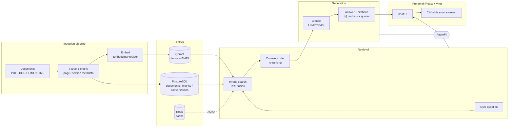

# RAG — RAG with clickable citations

A Retrieval-Augmented Generation system that ingests documents
(PDF / DOCX / Markdown / HTML), indexes them with **hybrid search** (dense
embeddings + BM25) in Qdrant, and answers questions with **Claude** using
structured, verifiable citations — every answer carries `[n]` markers backed by
exact quotes and a clickable source location (document, page, section).

> Portfolio project #2 — companion to "Nexus" (Node/React SaaS).

## Overview

- **Backend** — Python 3.11 + FastAPI, SQLAlchemy + Alembic, Pydantic Settings.
- **Vector DB** — Qdrant (dense + sparse/BM25 hybrid retrieval, RRF fusion).
- **App DB** — PostgreSQL (documents, chunks, conversations).
- **Cache** — Redis.
- **Embeddings** — OpenAI `text-embedding-3-small`, behind a swappable
  `EmbeddingProvider`.
- **LLM** — Claude (Anthropic API), behind a swappable `LLMProvider`, structured
  JSON output with citations.
- **Re-ranking** — cross-encoder (`bge-reranker-v2-m3`).
- **Frontend** — React + Vite + TypeScript.
- **Eval / Observability** — RAGAS, Langfuse, Prometheus/Grafana, structlog.

## Architecture



The data flow is: **ingestion pipeline → vector store → retrieval → generation →
frontend**.

## Repository layout

```
rag/
├── backend/            # FastAPI app (api, core, services, models, db, schemas)
│   ├── app/
│   ├── tests/
│   ├── requirements.txt
│   └── Dockerfile
├── frontend/           # Vite + React + TypeScript
│   ├── src/
│   ├── nginx.conf      # serves the SPA and proxies /health + /api to backend
│   └── Dockerfile
├── infra/
│   └── docker-compose.yml
├── .env.example        # root env for docker-compose
└── .github/workflows/  # CI: lint + tests (backend & frontend)
```

## How to run locally

### Option A — full stack with Docker (recommended)

Requires Docker + Docker Compose.

```bash
# from the repository root
docker-compose -f infra/docker-compose.yml up --build
```

This starts PostgreSQL, Qdrant, Redis, the backend, and the frontend. Defaults
are baked into the compose file, so no `.env` is required. To customise
credentials or ports, copy `.env.example` to `.env` first:

```bash
cp .env.example .env
```

Once it's up:

- Frontend: <http://localhost:5173>
- Backend health: <http://localhost:8000/health>
- API docs (Swagger): <http://localhost:8000/docs>

`GET /health` returns `200` with `{"status": "ok", ...}` when the app and all
three backing services (PostgreSQL, Qdrant, Redis) are reachable; it returns
`503` with `{"status": "degraded", ...}` if any dependency is down.

### Option B — run services separately (development)

**Backend**

```bash
cd backend
python -m venv .venv && source .venv/bin/activate   # Windows: .venv\Scripts\activate
pip install -r requirements-dev.txt
cp .env.example .env                                # point hosts at localhost
# start postgres/qdrant/redis however you like (e.g. the compose file above)
uvicorn app.main:app --reload
```

**Frontend**

```bash
cd frontend
npm install
npm run dev      # http://localhost:5173, proxies /health + /api to :8000
```

## Development commands

| Task                 | Command                                                    |
| -------------------- | ---------------------------------------------------------- |
| Backend tests        | `cd backend && pytest`                                     |
| Backend lint         | `cd backend && ruff check . && black --check .`            |
| Frontend lint        | `cd frontend && npm run lint`                              |
| Frontend tests       | `cd frontend && npm run test`                              |
| Frontend type-check  | `cd frontend && npm run build`                             |
| Full stack (Docker)  | `docker-compose -f infra/docker-compose.yml up --build`    |

## Status

Phase-by-phase progress (see `ROADMAP.md` for the full plan):

- ✅ **Phase 0 — Project scaffold**: monorepo structure, FastAPI `/health` with
  Postgres/Qdrant/Redis connectivity checks, React + Vite frontend showing the
  health status, Docker Compose for the full stack, and CI (lint + tests).
  Verified end-to-end via `docker-compose -f infra/docker-compose.yml up --build`:
  `GET /health` returns `200` with `{"status": "ok"}` and `postgres`, `qdrant`,
  and `redis` all reporting `"ok"` (confirmed both on the backend at `:8000` and
  through the frontend's nginx proxy at `:5173`).
- ✅ **Phase 1 — Ingestion & chunking with metadata**: `Document`/`Chunk`
  models with Alembic migrations; parsers for PDF (`pypdf`), DOCX
  (`python-docx`), Markdown (`markdown-it-py`) and HTML (`BeautifulSoup4`) that
  preserve page numbers and heading breadcrumbs (`section_path`); token-based
  chunking (`tiktoken`, ~400 tokens / ~50 overlap) that keeps
  `page_number`/`section_path` and `char_start`/`char_end` offsets; and the
  `POST /documents` (background processing), `GET /documents`,
  `GET /documents/{id}`, `GET /documents/{id}/chunks` endpoints. Verified
  end-to-end via docker-compose (upload → parse → chunk → `status=indexed`) and
  10 unit tests covering parser metadata and chunk overlap/offsets.
- ✅ **Phase 2 — Embeddings + Qdrant indexing**: swappable `EmbeddingProvider`
  with an OpenAI implementation (`text-embedding-3-small`, 1536-dim, batching +
  retry/backoff); a hybrid Qdrant collection (dense cosine vector `dense` +
  sparse BM25 vector `sparse` with the IDF modifier, via FastEmbed); an
  idempotent indexing job that embeds a document's chunks (dense + sparse) and
  upserts them into Qdrant keyed by chunk id, stamping `chunks.embedded_at`
  (migration `0002`, also exposed on `GET /documents/{id}/chunks`) so they are
  not reprocessed; automatic indexing after ingestion plus a manual
  `POST /documents/{id}/index` endpoint. Covered by Qdrant-backed integration
  tests (idempotency / no-duplicate / similarity search) that skip when Qdrant
  or `OPENAI_API_KEY` is unavailable. Verified end-to-end via docker-compose
  with **real OpenAI embeddings** (migration `0002` auto-applied on startup;
  uploading `sample.md` → `status=indexed`, every chunk's `embedded_at`
  populated, and the `chunks` collection holding a matching number of points
  with `dense` + `sparse` vectors).
- ✅ **Phase 3 — Hybrid retrieval + re-ranking**: a `RetrievalService` that
  embeds the query (dense + BM25 sparse), runs a hybrid Qdrant search — a
  `dense` and a `sparse` `Prefetch` fused server-side with `FusionQuery`/RRF —
  then re-ranks the fused candidates with a cross-encoder and returns the
  top-`k`. Supports a `document_ids` payload filter, and each result carries
  `chunk_id`, `document_id`, `document_filename`, `page_number`, `section_path`,
  `content`, the RRF `score` and the `rerank_score`. Exposed via
  `POST /retrieve` (internal/debug). The Qdrant server image was aligned to the
  client (`v1.18.0`) so the Query API runs without the version-skew warning.
  Covered by Qdrant-backed tests — including one that shows pure-dense search
  missing an exact-keyword chunk that hybrid (RRF) recovers — plus a
  cross-encoder re-ranking test; they skip when Qdrant is unavailable. The
  reranker default and the rationale are documented under
  [Re-ranking](#re-ranking). Verified end-to-end via docker-compose on the new
  Qdrant `v1.18.0` image (fresh volume): uploading `sample.md` → `status=indexed`,
  then `POST /retrieve` with `{"query": "What does section 2.1 discuss?",
  "top_k": 3}` returned the `Chapter 2 > Section 2.1` chunk on top — with the
  highest `rerank_score` (clearly separated from the rest) and the RRF `score`,
  `document_filename`, `section_path` and `content` all populated correctly.
- ✅ **Phase 4 — Cited generation**: a swappable `LLMProvider` (Anthropic
  implementation) with two stages — `generate_answer` streams a plain-text answer
  grounded only in the numbered context chunks, inserting `[n]` markers where each
  source is used; `extract_citations` runs a separate, forced tool-use call that
  returns `{number, chunk_id, quote}` objects, dropping any unknown `chunk_id` and
  repairing each `quote` to the exact verbatim span in its chunk (the model
  normalizes the chunk's hard line-wrap newlines into spaces when quoting, so the
  span is snapped back for offset-accurate highlighting). A `ChatService` ties
  retrieval and generation together: it creates a `Conversation` and persists the
  user/assistant `Message`s (migration `0003`), short-circuits to a fixed
  "I don't have enough information…" answer **without calling the LLM** when
  retrieval is empty (zero token cost), and enriches each citation with
  `document_id`/`document_name`/`page`/`section`. Exposed via `POST /chat`
  (Server-Sent Events: a stream of `delta` events then a terminal `citations`
  event; `503` without `ANTHROPIC_API_KEY`). Models are configurable
  (`generation_model` default `claude-sonnet-4-6`, `citation_extraction_model`
  default `claude-haiku-4-5-20251001`). Covered by unit tests over in-memory
  SQLite with a fake provider (streaming/persistence, conversation reuse, the
  no-chunks short-circuit, the verbatim-quote repair) plus real-Anthropic
  integration tests that skip without a key. Verified end-to-end via
  docker-compose with **real Claude**: uploading `sample.md` → `status=indexed`,
  then `POST /chat` (via `curl -N`) for "What does section 2.1 discuss?" streamed
  the answer incrementally (multiple `delta` events over ~2 s) and returned
  citations whose `quote`s are exact, newline-accurate substrings of the cited
  chunk; an unrelated question returned the "I don't have enough information…"
  refusal with no citations.
- ✅ **Phase 5 — Frontend: chat + clickable citations**: a React + Vite + TS SPA
  (React Router) with two pages. **Chat** streams the answer live by reading the
  `POST /chat` SSE body (`fetch` + `ReadableStream`, accumulating `delta` text);
  once the terminal `citations` event arrives, `CitedAnswer` parses the `[n]`
  markers and renders each as a clickable badge. Clicking a badge opens the
  **`SourceViewer`** side panel, which fetches the full chunk via the new
  `GET /chunks/{id}` and highlights the cited `quote` inside the passage. The
  `conversation_id` from the first turn is threaded into subsequent calls for a
  continuous conversation. **Documents** supports drag-and-drop / file-picker
  upload (`POST /documents`), a table of documents with status, chunk count and
  upload time (light 3 s polling so `pending → processing → indexed/failed`
  updates live), and deletion via the new `DELETE /documents/{id}` (cascades to
  chunks, best-effort cleanup of the Qdrant points and the stored source file).
  Backend tests cover `GET /chunks/{id}` and the delete cascade over in-memory
  SQLite (ASGI transport, Qdrant/filesystem stubbed); each new frontend component
  has a Vitest test (React Testing Library + stubbed `fetch`, including a
  `ReadableStream` SSE double). `npm run test`, `npm run lint` and `npm run build`
  all pass. Dev (Vite) and Docker (nginx) proxies forward the new `/documents`,
  `/chunks` and `/chat` paths (SSE buffering disabled in nginx). End-to-end
  verification via `docker-compose up` is the remaining step before merge.
- ⬜ Later phases: evaluation (RAGAS), observability/cost, and deploy/CI-CD.

### API endpoints

| Method & path                    | Description                                            |
| -------------------------------- | ------------------------------------------------------ |
| `GET /health`                    | App + dependency (Postgres/Qdrant/Redis) status        |
| `POST /documents`                | Upload a PDF/DOCX/MD/HTML file; ingests in background   |
| `GET /documents`                 | List uploaded documents with status                    |
| `GET /documents/{id}`            | Document details + chunk count                          |
| `DELETE /documents/{id}`         | Delete a document (cascades to chunks; clears vectors + file) |
| `GET /documents/{id}/chunks`     | List a document's chunks with citation metadata         |
| `POST /documents/{id}/index`     | Re-embed and (re-)index a document into Qdrant (hybrid)  |
| `GET /chunks/{id}`               | Fetch a single chunk by id (source viewer)             |
| `POST /retrieve`                 | Hybrid search + re-ranking (internal/debug); scored chunks |
| `POST /chat`                     | Cited answer generation over SSE (`delta` stream + `citations`) |

### Re-ranking

Retrieval is two-stage: a fast hybrid first stage (dense + BM25, fused with RRF
in Qdrant) over-fetches ~20 candidates, then a **cross-encoder** re-scores each
`(query, chunk)` pair jointly and the top-`k` are returned.

The default cross-encoder is **`cross-encoder/ms-marco-MiniLM-L-6-v2`** (set via
`RERANKER_MODEL`). It was chosen deliberately for this CPU-only Docker setup: at
~80 MB it builds and downloads quickly and re-ranks ~20 candidates in
milliseconds on CPU. Heavier rerankers such as `BAAI/bge-reranker-v2-m3` are
more accurate but several times larger and noticeably slower to load and run
without a GPU — overkill for a local/demo deployment. Swapping is trivial:
`RERANKER_MODEL` accepts any `sentence-transformers` cross-encoder, so a
GPU-backed deployment can opt into a stronger model with no code change.

> Torch is installed from PyTorch's **CPU-only wheel index**
> (`--extra-index-url https://download.pytorch.org/whl/cpu` in
> `requirements.txt`) to avoid pulling multi-GB CUDA builds that this image
> would never use.
