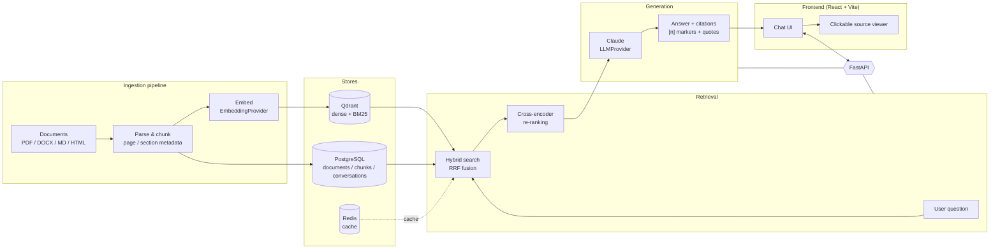

# RAG — RAG with clickable citations

A Retrieval-Augmented Generation system that ingests documents
(PDF / DOCX / Markdown / HTML), indexes them with **hybrid search** (dense
embeddings + BM25) in Qdrant, and answers questions with **Claude** using
structured, verifiable citations — every answer carries `[n]` markers backed by
exact quotes and a clickable source location (document, page, section).

> Portfolio project #2 — companion to "Nexus" (Node/React SaaS).

## Overview

- **Backend** — Python 3.11 + FastAPI, SQLAlchemy + Alembic, Pydantic Settings.
- **Vector DB** — Qdrant (dense + sparse/BM25 hybrid retrieval, RRF fusion).
- **App DB** — PostgreSQL (documents, chunks, conversations).
- **Cache** — Redis.
- **Embeddings** — OpenAI `text-embedding-3-small`, behind a swappable
  `EmbeddingProvider`.
- **LLM** — Claude (Anthropic API), behind a swappable `LLMProvider`, structured
  JSON output with citations.
- **Re-ranking** — cross-encoder (`bge-reranker-v2-m3`).
- **Frontend** — React + Vite + TypeScript.
- **Eval / Observability** — RAGAS, Langfuse, Prometheus/Grafana, structlog.

## Architecture



The data flow is: **ingestion pipeline → vector store → retrieval → generation →
frontend**.

## Repository layout

```
rag/
├── backend/            # FastAPI app (api, core, services, models, db, schemas)
│   ├── app/
│   ├── tests/
│   ├── requirements.txt
│   └── Dockerfile
├── frontend/           # Vite + React + TypeScript
│   ├── src/
│   ├── nginx.conf      # serves the SPA and proxies /health + /api to backend
│   └── Dockerfile
├── infra/
│   └── docker-compose.yml
├── .env.example        # root env for docker-compose
└── .github/workflows/  # CI: lint + tests (backend & frontend)
```

## How to run locally

### Option A — full stack with Docker (recommended)

Requires Docker + Docker Compose.

```bash
# from the repository root
docker-compose -f infra/docker-compose.yml up --build
```

This starts PostgreSQL, Qdrant, Redis, the backend, and the frontend. Defaults
are baked into the compose file, so no `.env` is required. To customise
credentials or ports, copy `.env.example` to `.env` first:

```bash
cp .env.example .env
```

Once it's up:

- Frontend: <http://localhost:5173>
- Backend health: <http://localhost:8000/health>
- API docs (Swagger): <http://localhost:8000/docs>

`GET /health` returns `200` with `{"status": "ok", ...}` when the app and all
three backing services (PostgreSQL, Qdrant, Redis) are reachable; it returns
`503` with `{"status": "degraded", ...}` if any dependency is down.

### Option B — run services separately (development)

**Backend**

```bash
cd backend
python -m venv .venv && source .venv/bin/activate   # Windows: .venv\Scripts\activate
pip install -r requirements-dev.txt
cp .env.example .env                                # point hosts at localhost
# start postgres/qdrant/redis however you like (e.g. the compose file above)
uvicorn app.main:app --reload
```

**Frontend**

```bash
cd frontend
npm install
npm run dev      # http://localhost:5173, proxies /health + /api to :8000
```

## Development commands

| Task                 | Command                                                    |
| -------------------- | ---------------------------------------------------------- |
| Backend tests        | `cd backend && pytest`                                     |
| Backend lint         | `cd backend && ruff check . && black --check .`            |
| Frontend lint        | `cd frontend && npm run lint`                              |
| Frontend tests       | `cd frontend && npm run test`                              |
| Frontend type-check  | `cd frontend && npm run build`                             |
| Full stack (Docker)  | `docker-compose -f infra/docker-compose.yml up --build`    |

## Status

Phase-by-phase progress (see `ROADMAP.md` for the full plan):

- ✅ **Phase 0 — Project scaffold**: monorepo structure, FastAPI `/health` with
  Postgres/Qdrant/Redis connectivity checks, React + Vite frontend showing the
  health status, Docker Compose for the full stack, and CI (lint + tests).
  Verified end-to-end via `docker-compose -f infra/docker-compose.yml up --build`:
  `GET /health` returns `200` with `{"status": "ok"}` and `postgres`, `qdrant`,
  and `redis` all reporting `"ok"` (confirmed both on the backend at `:8000` and
  through the frontend's nginx proxy at `:5173`).
- ⬜ Later phases: ingestion, hybrid retrieval, cited generation, evaluation.
